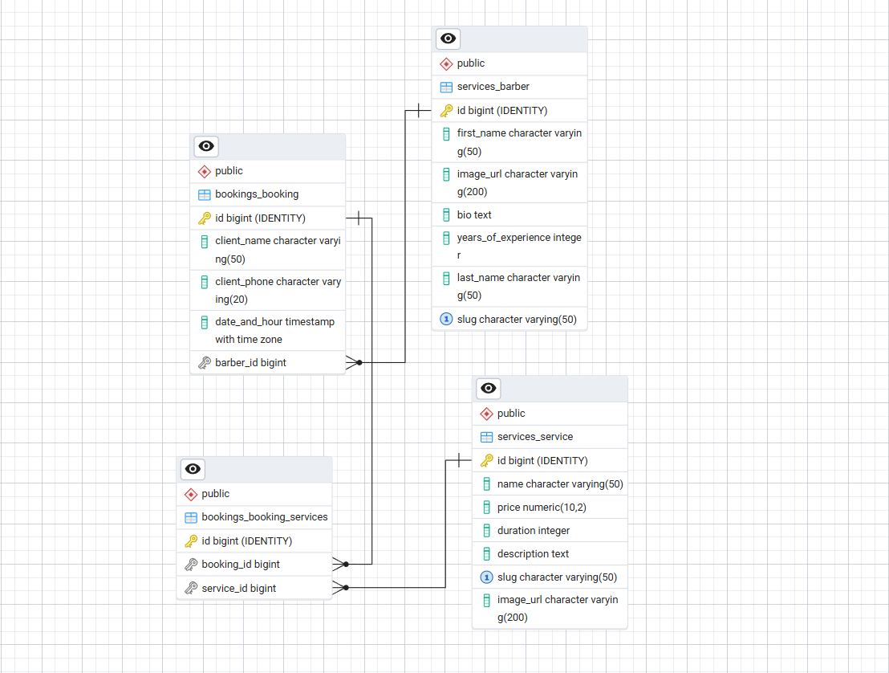

# BarberShop Project Documentation

## 1. Introduction
BarberShop is a monolithic web application developed using the Django framework. Its primary goal is to digitize the appointment booking process in a barber shop, streamlining communication between clients and service providers.

## 2. Architecture (Django Apps)

### 2.1 Database Schema (ERD)

The project is divided into several logical components (applications):
### 2.1. `bookings`
This application handles the core business logic for managing appointments.
It provides full CRUD functionality for bookings and allows staff members to view and manage bookings through a dedicated dropdown menu.
- **Models:** Contains a `Booking` model that stores information about:
  - The client 
  - The selected service (linked to the Service model)
  - The selected Barber (linked to the Barber model)
  - Date and time of the reservation

- **Views:** Includes forms for creating new bookings, editing and deleting existing ones, and viewing a user's booking history.

### 2.2. `services`
This application provides full CRUD functionality for barbers and services and allows staff members to view and manage barbers and services through a dedicated dropdown menu.

- **Models:** 
- A `Service` model containing:
  - Service name (e.g., "Men's Haircut")
  - Description
  - Price
  - Duration (in minutes)

- A `Barber` model containing: 
  - Barber first and last name
  - Barber bio
  - Years of experience
  
- **Views:**: Provides list, detail, and full CRUD operations for both the `Barber` and `Service` models.

### 2.3. `web` (Main Interface)
Serves to manage general pages that are not strictly tied to services or bookings.
- **Views:** Home page.

## 3. Templates and Design (Templates & Static)
- **`templates/`**: Based on the Django Template Language. The architecture likely follows the principle of template inheritance (e.g., using a `base.html`) to avoid repeating headers and footers across different pages.
- **`static/css/`**: Contains custom styles for the application. The design should be responsive to work well on both desktop and mobile devices.

## 4. Dependencies
All required Python packages are listed in the `requirements.txt` file. The primary dependency is `Django`. To ensure compatibility and avoid conflicts, it is highly recommended to run the project in an isolated virtual environment (`venv`).

## 5. Future Development (Roadmap)
*Potential ideas for future upgrades:*
- Implementing User account logic.
- Integration of email notifications upon successful booking.
- Adding an online payment system (e.g., Stripe).
- An option for clients to leave reviews and ratings.
- Building a REST API via Django Rest Framework for a potential future mobile app.

- ## 6. Environment and Security
To ensure security and portability, the project uses environment variables and virtual environments.

### 6.1. Virtual Environment (`venv`)
The project dependencies (like Django) are managed within a Python virtual environment. This prevents conflicts with global system packages and ensures that every developer uses the exact same versions of the libraries.

### 6.2. Environment Variables (`.env`)
Sensitive data such as the `SECRET_KEY`, database credentials, and `DEBUG` mode are stored in a `.env` file. This file is excluded from the Git repository (via `.gitignore`) to prevent accidental exposure of secrets in public version control.